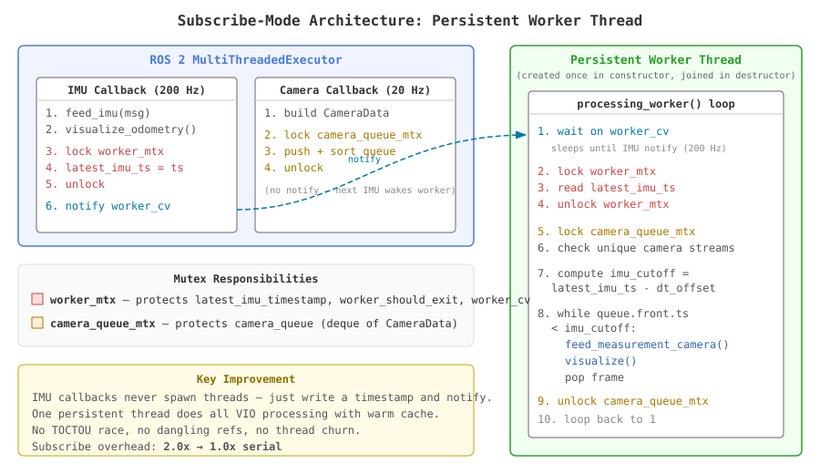

# Subscribe-Mode Determinism

OpenVINS has two ways to run the VIO pipeline on ROS 2: a **serial** node that
reads a bag file sequentially (deterministic, reproduces runs bit-for-bit) and
a **subscribe** node that receives messages over DDS (what real hardware
deployments use). Upstream, subscribe mode was non-deterministic in ways that
could cascade into catastrophic SLAM failure.

This doc describes the two fork changes that fix it:

1. **Persistent worker thread** — architectural root-cause fix. Replaces the
   per-frame `std::thread` + `detach()` dispatch with a single long-lived
   worker. Eliminates a TOCTOU race, a dangling-reference UB, and
   non-deterministic IMU triggering. Reduces subscribe-mode overhead from
   2× serial to 1× serial.
2. **SLAM recovery mechanism** — defense-in-depth safety net. When the SLAM
   feature count dips below 25% of `max_slam`, the chi-squared gate for
   `delayed_init` is relaxed 3× so the state can recover. Rarely activates
   with the persistent worker in place, but protects against edge cases.

Both changes are on by default in this fork.

---

## 1. Problem: SLAM feature state collapse

When running OpenVINS in subscribe mode (`run_subscribe_msckf`) **without the
fixes described below**, the SLAM feature state can collapse to zero within
the first ~50 frames and never recover.

### What "SLAM feature state collapse" means

OpenVINS maintains two types of visual features in its EKF state:

- **MSCKF features**: one-shot features that are tracked across several frames, used
  for a single EKF update when they are lost, then discarded. These provide
  frame-to-frame motion estimates but don't persist.

- **SLAM features** (up to `max_slam=50` by default): long-lived features that are
  added to the EKF state vector as persistent landmarks. These are tracked
  continuously and updated every frame. They anchor the trajectory over time and
  reduce long-term drift.

A feature becomes a SLAM candidate when it has been tracked for `max_clone_size`
(11) consecutive frames, proving it is stable. The candidate is then triangulated
and must pass a **chi-squared consistency test** in `UpdaterSLAM::delayed_init()`
before being admitted to the state. This test checks whether the feature's
measurements are consistent with the current state estimate — if the residuals are
too large (indicating the state or feature position is inaccurate), the feature is
rejected.

**The collapse happens in this sequence:**

1. The SLAM state fills to 50 features within the first ~15 frames (normal).
2. Around frames 24-35, some SLAM features lose tracking and are marginalized
   (removed from state). This is normal churn.
3. New candidate features that would replace them **fail the chi-squared test**.
   The residuals are slightly elevated due to the non-deterministic state drift
   from subscribe-mode scheduling (see Root Cause below). In serial mode, these
   same candidates would pass — the difference is within the test's margin.
4. With features being marginalized faster than they are replaced, the SLAM state
   empties.
5. **The empty state is irrecoverable**: new candidates need 11 frames to mature,
   but during that time the estimator runs on MSCKF-only mode, which drifts.
   The increased drift makes future chi-squared tests even more likely to reject,
   creating a feedback loop.
6. The system runs in MSCKF-only mode for the remainder of the sequence,
   accumulating unbounded drift — diverging by **hundreds of meters** on sequences
   like EuRoC V2_02_medium (an 85-meter trajectory).

In our pre-fix testing on V2_02, this happened in **~30% of subscribe runs** on x86
(i7-1185G7, Ubuntu 22.04), despite the hardware easily sustaining 20 fps with
ample headroom (20ms per frame vs 50ms budget, zero frame drops). It is a
correctness issue, not a performance issue.

Serial mode (`ros2_serial_msckf`) is unaffected — it produces identical results
every run because it reads messages in strict timestamp order with no middleware
non-determinism.

## 2. Root cause: ROS 2 middleware non-determinism

Subscribe mode introduces non-determinism through the ROS 2 middleware:

1. **Variable starting frames.** The `ApproximateTime` stereo sync policy and DDS
   publisher discovery timing cause the subscriber to receive its first frames at
   slightly different points in the sequence across runs (up to ~50ms spread even
   with a 5-second bag play delay).

2. **IMU-triggered VIO dispatch.** The VIO update is triggered by IMU callbacks
   (200 Hz), which check an atomic flag (`thread_update_running`) and spawn a
   detached thread to process queued camera frames. Which specific IMU callback
   triggers each update depends on when the previous update finished — introducing
   per-frame variability in IMU integration boundaries.

These produce small numerical differences in the state estimate. In most runs, the
differences are harmless. But occasionally, during a critical window in the first
~25 frames after SLAM features start being promoted, enough features fail the
chi-squared consistency test in `UpdaterSLAM::delayed_init()` to trigger an
irrecoverable cascade:

1. SLAM features that lose tracking are marginalized
2. New candidates that would replace them also fail the chi-squared test
   (residuals are slightly elevated due to the state drift from fewer features)
3. With no features entering the SLAM state, the system runs in MSCKF-only mode
4. Without persistent SLAM landmarks to anchor the trajectory, drift accumulates

---

## 3. Root-cause fix: Persistent worker thread

**Branch:** `persistent-worker-thread`
**Files changed:** `ov_msckf/src/ros/ROS2Visualizer.{h,cpp}` (+86/−51 lines)

We replaced the per-frame `std::thread` + `detach()` VIO dispatch pattern in
`ROS2Visualizer::callback_inertial` with a single persistent worker thread that
processes camera frames in timestamp order. This eliminates four bugs in the
upstream code and reduces subscribe-mode wall-clock overhead from **2.0× serial**
to **1.0× serial** (i.e., subscribe now runs at serial speed).

### What changed architecturally

#### Before (upstream `detach()` pattern)

```
  IMU callback (200 Hz, on executor thread):
    1. feed_imu() — buffer IMU data
    2. if (!thread_update_running) — atomic bool check (NO LOCK)
    3.   thread_update_running = true
    4.   spawn std::thread with [&] lambda
    5.   thread.detach()  ← thread runs unsupervised
                            ← callback returns, local vars destroyed
                            ← lambda still reads message.timestamp (UB)

  Spawned thread (~20 created+destroyed per second):
    1. lock camera_queue_mtx
    2. process eligible camera frames
    3. thread_update_running = false
    4. thread exits (destroyed)

  Camera callback (20 Hz):
    1. lock camera_queue_mtx
    2. push frame to queue, sort
```

#### After (persistent worker thread)

```
  IMU callback (200 Hz, on executor thread):
    1. feed_imu() — buffer IMU data
    2. lock worker_mtx                         ← mutex A
    3. latest_imu_timestamp = msg.timestamp     (member variable, not stack)
    4. unlock worker_mtx
    5. notify worker_cv

  Worker thread (ONE for entire run, created in constructor):
    loop:
      1. wait on worker_cv
      2. lock worker_mtx                       ← mutex A
      3. read latest_imu_timestamp
      4. unlock worker_mtx
      5. lock camera_queue_mtx                 ← mutex B
      6. process eligible camera frames
      7. unlock camera_queue_mtx
      8. loop back to 1

  Camera callback (20 Hz):
    1. lock camera_queue_mtx                   ← mutex B
    2. push frame to queue, sort
    3. unlock camera_queue_mtx
    4. notify worker_cv
```

Two mutexes, each protecting a distinct resource:

| Mutex | Protects | Writers | Readers |
|-------|----------|---------|---------|
| **`worker_mtx`** (A) | `latest_imu_timestamp`, `worker_should_exit` | IMU callback, destructor | Worker thread |
| **`camera_queue_mtx`** (B) | `camera_queue` deque | Camera callbacks | Worker thread |

Lock ordering is always A then B (worker locks `worker_mtx` first, then
`camera_queue_mtx`), so no deadlock is possible.

#### Architecture diagram



### Bugs fixed

| Bug | Before | After |
|-----|--------|-------|
| **TOCTOU race** | Two IMU callbacks can both read `thread_update_running = false` and spawn concurrent update threads | No flag; single worker always alive |
| **Dangling reference UB** | Lambda captures `[&]`, reads `message.timestamp` from caller's stack after `detach()` returns | IMU timestamp written to member variable under mutex |
| **Non-deterministic trigger** | Which IMU callback spawns the update depends on when the previous thread finished | Worker always uses the latest IMU timestamp |
| **Thread churn** | ~20 `std::thread` create/destroy per second, each with cold cache | One persistent thread with warm cache across all frames |

### Benchmark results

#### Hardware

- **Our system:** Intel i7-1185G7 (Tiger Lake, 4C/8T, 4.8 GHz boost), 16 GB, Ubuntu 22.04
- **Paper (Semenova et al. 2024):** Intel i7-7500U (Kaby Lake, 2C/4T, 3.5 GHz boost), 32 GB, Ubuntu 18.04

#### How to reproduce

All tables below were generated by two invocations of `run_full_benchmark.sh`,
one against the old-dispatch submodule commit and one against the persistent-worker
commit:

```bash
# Persistent-worker baseline (submodule at 0fe81a6 or newer):
bash run_full_benchmark.sh -r 5 --tag bench_persistent_worker

# Old-dispatch comparison (check out submodule at the pre-worker commit first):
bash run_full_benchmark.sh -r 5 --tag bench_5rep_3clock
```

Both write to `~/results/timing/x86/{serial,subscribe}/<tag>/`. The `*Source:*`
lines on each table below point at the specific CSVs produced.

#### Subscribe total: old dispatch vs persistent worker

**Clock:** wall (to match the paper's methodology — the paper reports wall time
and this is the most direct apples-to-apples comparison). Thread-clock totals
differ by <0.2 ms on x86 post-fix; see §"Per-component comparison" below for
both. Cells list the 5 individual runs' means (ms).

| Sequence | Old dispatch (5 reps) | Persistent worker (5 reps) | Serial |
|----------|----------------------|---------------------------|--------|
| V1_01_easy 4-thr | 21.2, 21.2, 21.3, 21.3, 21.1 | **11.8, 11.9, 12.0, 11.8, 12.1** | 11.5 |
| V1_01_easy 1-thr | 21.7, 21.9, 21.9, 21.9, 21.8 | **12.7, 12.7, 12.8, 12.7, 12.7** | 12.8 |
| MH_03_medium 4-thr | 20.2, 19.6, 21.3, 19.0, 21.4 | **10.7, 10.7, 10.9, 10.7, 10.8** | 11.5 |
| V2_02_medium 4-thr | 20.8, 20.7, 20.6, 20.7, 20.7 | **10.4, 10.5, 10.6, 10.7, 10.7** | 11.2 |
| V2_02_medium 1-thr | 21.3, 21.4, 21.1, 21.0, 21.1 | **11.2, 11.2, 11.2, 11.3, 11.3** | 11.5 |

*Source: Old dispatch from `results/timing/x86/subscribe/bench_5rep_3clock/*_{1,4}thr_run{1..5}_wall.txt`; persistent worker from `results/timing/x86/subscribe/bench_persistent_worker/*_{1,4}thr_run{1..5}_wall.txt`; serial reference from `results/timing/x86/serial/bench_persistent_worker/*_{1,4}thr_wall.txt`*

Subscribe/serial ratio: **2.0× → 1.0×** (eliminated entirely).

#### Per-component comparison with paper: V2_02, 4 OpenCV threads (ms)

**Clocks:** paper column uses wall (their methodology); our "sub (wall)" and
"serial (wall)" are wall-clock; "serial (proc CPU)" is `CLOCK_PROCESS_CPUTIME_ID`
(sum of CPU across all threads, useful for thermal/power budget). Cells are
`mean ± std` over per-frame values.

| Component | Paper¹ (sub, wall) | Old dispatch (sub, wall) | **Worker (sub, wall)** | Serial (wall) | Serial (proc CPU) |
|-----------|-------------------|-------------------------|----------------------|--------------|-------------------|
| Tracking | 6.12 ± 1.13 | 8.4 ± 2.1 | **3.0 ± 0.6** | 3.1 ± 0.6 | 9.0 ± 1.4 |
| Propagation | 0.21 ± 0.04 | 0.4 ± 0.1 | **0.2 ± 0.0** | 0.2 ± 0.0 | 0.2 ± 0.0 |
| MSCKF Update | 1.31 ± 1.69 | 2.6 ± 2.8 | **1.3 ± 1.5** | 1.3 ± 1.6 | 1.3 ± 1.6 |
| SLAM Update² | 6.56 ± 3.84 | 7.4 ± 3.7 | **4.5 ± 2.2** | 5.0 ± 2.6 | 5.0 ± 2.6 |
| Re-tri & Marg | 2.24 ± 0.20 | 2.0 ± 0.7 | **1.5 ± 0.2** | 1.6 ± 0.1 | 2.2 ± 0.2 |
| **Total** | **16.43 ± 4.53** | **20.8 ± 4.5** | **10.4 ± 2.9** | **11.2 ± 3.3** | **17.8 ± 3.5** |

p99 per-frame totals: Worker sub 19.2 ms, Serial wall 17.1 ms — both within the 50 ms @ 20 Hz budget.

*Source: Paper column from Semenova et al. 2024 Table 4; Old dispatch from `results/timing/x86/subscribe/bench_5rep_3clock/V2_02_medium_4thr_run1_{wall,cpu,thread}.txt`; Worker from `results/timing/x86/subscribe/bench_persistent_worker/V2_02_medium_4thr_run1_{wall,cpu,thread}.txt`; Serial from `results/timing/x86/serial/bench_persistent_worker/V2_02_medium_4thr_{wall,cpu,thread}.txt`*

¹ Semenova et al. 2024, Table 4 — subscribe mode, wall clock
² Paper combines SLAM Update + SLAM Delayed; our values shown combined for comparison

#### Per-component comparison with paper: V2_02, 1 OpenCV thread (ms)

**Clock:** all wall (paper methodology). Cells are `mean ± std`.

| Component | Paper¹ (sub, wall) | Old dispatch (sub, wall) | **Worker (sub, wall)** | Serial (wall) |
|-----------|-------------------|-------------------------|----------------------|--------------|
| Tracking | 8.55 ± 1.31 | 10.9 ± 2.5 | **4.0 ± 0.7** | 4.0 ± 0.8 |
| Propagation | 0.24 ± 0.03 | 0.4 ± 0.1 | **0.2 ± 0.0** | 0.2 ± 0.0 |
| MSCKF Update | 1.66 ± 2.11 | 2.1 ± 2.3 | **1.2 ± 1.4** | 1.2 ± 1.5 |
| SLAM Update² | 8.28 ± 4.79 | 6.2 ± 3.2 | **4.4 ± 2.3** | 4.6 ± 2.4 |
| Re-tri & Marg | 2.52 ± 0.21 | 1.7 ± 0.4 | **1.4 ± 0.2** | 1.5 ± 0.2 |
| **Total** | **21.25 ± 5.57** | **21.3 ± 4.2** | **11.2 ± 2.9** | **11.5 ± 3.1** |

*Source: Paper column from Semenova et al. 2024 Table 4; Old dispatch from `results/timing/x86/subscribe/bench_5rep_3clock/V2_02_medium_1thr_run*_wall.txt`; Worker from `results/timing/x86/subscribe/bench_persistent_worker/V2_02_medium_1thr_run*_wall.txt`; Serial from `results/timing/x86/serial/bench_persistent_worker/V2_02_medium_1thr_wall.txt`*

#### Cross-run variability (subscribe, 5 repetitions)

**Clock:** wall. Mean/std/CV here are computed across the 5 per-run totals
(each per-run total is itself a mean over ~2800 per-frame wall-clock values).

| Sequence | Config | Mean (ms) | Std (ms) | CV | Range (ms) |
|----------|--------|----------|---------|-----|-----------|
| V1_01_easy | 4-thr | 11.9 | 0.13 | **1.1%** | 11.8 – 12.1 |
| V1_01_easy | 1-thr | 12.7 | 0.04 | **0.3%** | 12.7 – 12.8 |
| MH_03_medium | 4-thr | 10.8 | 0.09 | **0.8%** | 10.7 – 10.9 |
| MH_03_medium | 1-thr | 11.5 | 0.08 | **0.7%** | 11.4 – 11.6 |
| V2_02_medium | 4-thr | 10.6 | 0.13 | **1.2%** | 10.4 – 10.7 |
| V2_02_medium | 1-thr | 11.2 | 0.05 | **0.5%** | 11.2 – 11.3 |

*Source: `results/timing/x86/subscribe/bench_persistent_worker/{V1_01_easy,MH_03_medium,V2_02_medium}_{1,4}thr_run{1..5}_wall.txt`*

All configurations have CV < 1.3%. The old dispatch had CV up to 5% on MH_03.

#### SLAM feature health (avg features in state, max_slam=50)

| Sequence | Serial | Worker subscribe (5 reps) | Old dispatch subscribe (5 reps) |
|----------|--------|--------------------------|-------------------------------|
| V1_01_easy | 46.3 | 46.1, 46.1, 46.3, 46.1, 46.4 | 43.8 – 44.7 |
| MH_03_medium | 41.0 | 41.1, 41.2, 41.1, 41.3, 41.4 | **26.0** – 40.2 |
| V2_02_medium | 39.1 | 38.2, 38.3, 38.6, 38.7, 38.9 | 34.5 – 35.8 |

*Source: Serial from `results/timing/x86/serial/bench_persistent_worker/*_4thr_feats.txt`; Worker subscribe from `results/timing/x86/subscribe/bench_persistent_worker/*_4thr_run{1..5}_feats.txt`; Old dispatch from `results/timing/x86/subscribe/bench_5rep_3clock/*_4thr_run{1..5}_feats.txt`*

Subscribe SLAM health now matches serial within <1 feature. The old dispatch had
a worst case of 26.0 on MH_03 (partial SLAM dip).

#### ATE — Absolute Trajectory Error (posyaw alignment)

**Position RMSE (meters) across all runs:**

| Sequence | Serial | Sub 4-thr run 1 | run 2 | run 3 | run 4 | run 5 | Sub 1-thr run 1 | run 2 | run 3 | run 4 | run 5 |
|----------|--------|-----------------|-------|-------|-------|-------|-----------------|-------|-------|-------|-------|
| V1_01_easy | 1.946 | 1.943 | 1.944 | 1.945 | 1.943 | 1.945 | 1.945 | 1.946 | 1.945 | 1.945 | 1.946 |
| MH_03_medium | 3.450 | 3.441 | 3.442 | 3.441 | 3.441 | 3.445 | 3.441 | 3.441 | 3.440 | 3.441 | 3.441 |
| V2_02_medium | 2.099 | 2.101 | 2.098 | 2.094 | ov_eval¹ | 2.102 | 2.091 | 2.091 | 2.092 | 2.102 | 2.097 |

¹ ov_eval NaN assertion crash on a healthy trajectory (tool bug, not a divergence —
final position is correct).

*Source: Serial from `results/timing/x86/serial/bench_persistent_worker/{V1_01_easy,MH_03_medium,V2_02_medium}_{1,4}thr_est.txt`; subscribe from `results/timing/x86/subscribe/bench_persistent_worker/{V1_01_easy,MH_03_medium,V2_02_medium}_{1,4}thr_run{1..5}_est.txt`; compared against `src/open_vins/ov_data/euroc_mav/{V1_01_easy,MH_03_medium,V2_02_medium}.txt`*

**Orientation RMSE (millidegrees) across all runs:**

| Sequence | Serial | Sub 4-thr (5 reps) | Sub 1-thr (5 reps) |
|----------|--------|-------------------|-------------------|
| V1_01_easy | 134.6 | 134.9, 134.9, 134.6, 134.8, 134.9 | 134.6, 134.9, 134.7, 135.5, 134.9 |
| MH_03_medium | 147.2 | 146.0, 148.9, 146.8, 145.3, 145.7 | 147.1, 146.5, 146.8, 145.9, 146.6 |
| V2_02_medium | 122.4 | 122.6, 122.9, 122.3, —¹, 122.5 | 123.1, 122.9, 122.9, 122.7, 122.7 |

*Source: same `*_est.txt` files as the Position RMSE table (orientation RMSE is extracted from the same `error_singlerun` outputs).*

**Cross-run variability summary:**

| Sequence | Serial ATE pos | Subscribe ATE pos range | Max deviation | Subscribe ATE pos std |
|----------|---------------|------------------------|---------------|----------------------|
| V1_01_easy | 1.946m | 1.943 – 1.946m | **0.003m** | **0.001m** |
| MH_03_medium | 3.450m | 3.440 – 3.445m | **0.010m** | **0.002m** |
| V2_02_medium | 2.099m | 2.091 – 2.102m | **0.008m** | **0.004m** |

*Source: derived from the Position RMSE table above — same `*_est.txt` files under `results/timing/x86/{serial,subscribe}/bench_persistent_worker/`.*

#### RPE — Relative Pose Error (median position, meters)

RPE measures local consistency over trajectory segments. Serial vs subscribe
run 1 comparison (4-thread):

**V1_01_easy:**

| Segment | Serial | Subscribe | Delta |
|---------|--------|-----------|-------|
| 8m | 3.222 | 3.202 | 0.020 |
| 16m | 2.832 | 2.826 | 0.006 |
| 24m | 2.874 | 2.873 | 0.001 |
| 32m | 2.458 | 2.434 | 0.024 |
| 40m | 2.378 | 2.363 | 0.015 |

*Source: Serial from `results/timing/x86/serial/bench_persistent_worker/V1_01_easy_4thr_est.txt`; Subscribe run 1 from `results/timing/x86/subscribe/bench_persistent_worker/V1_01_easy_4thr_run1_est.txt`.*

**MH_03_medium:**

| Segment | Serial | Subscribe | Delta |
|---------|--------|-----------|-------|
| 8m | 5.675 | 5.663 | 0.012 |
| 16m | 3.531 | 3.534 | 0.003 |
| 24m | 4.884 | 4.893 | 0.009 |
| 32m | 5.362 | 5.391 | 0.029 |
| 40m | 3.442 | 3.438 | 0.004 |

*Source: Serial from `results/timing/x86/serial/bench_persistent_worker/MH_03_medium_4thr_est.txt`; Subscribe run 1 from `results/timing/x86/subscribe/bench_persistent_worker/MH_03_medium_4thr_run1_est.txt`.*

**V2_02_medium:**

| Segment | Serial | Subscribe | Delta |
|---------|--------|-----------|-------|
| 8m | 2.861 | 2.870 | 0.009 |
| 16m | 3.234 | 3.230 | 0.004 |
| 24m | 2.710 | 2.682 | 0.028 |
| 32m | 3.215 | 3.171 | 0.044 |
| 40m | 3.032 | 3.029 | 0.003 |

*Source: Serial from `results/timing/x86/serial/bench_persistent_worker/V2_02_medium_4thr_est.txt`; Subscribe run 1 from `results/timing/x86/subscribe/bench_persistent_worker/V2_02_medium_4thr_run1_est.txt`.*

RPE deltas are <0.05m across all segments and sequences — subscribe local
consistency matches serial.

#### Process CPU reveals OpenCV parallelism cost (V2_02, 4-thr)

| Mode | Wall | Proc CPU | Thread | CPU/Wall |
|------|------|----------|--------|----------|
| Serial | 11.2 | **17.8** | 11.1 | **1.59×** |
| Subscribe (worker) | 10.4 | **16.6** | 10.4 | **1.60×** |
| Subscribe (old dispatch) | 20.8 | **37.0** | 20.6 | **1.78×** |

*Source: Serial from `results/timing/x86/serial/bench_persistent_worker/V2_02_medium_4thr_{wall,cpu,thread}.txt`; Subscribe worker from `results/timing/x86/subscribe/bench_persistent_worker/V2_02_medium_4thr_run1_{wall,cpu,thread}.txt`; Subscribe old-dispatch from `results/timing/x86/subscribe/bench_5rep_3clock/V2_02_medium_4thr_run1_{wall,cpu,thread}.txt`*

CPU/Wall is now identical between serial and subscribe (1.59–1.60×) — purely the
OpenCV KLT thread pool. The old dispatch had 1.78× because executor threads burned
extra CPU during per-frame thread churn.

#### RPi5 projections

| Sequence | x86 serial | x86 subscribe (worker) | RPi5 serial (×3.5) | Budget (20 Hz) |
|----------|-----------|----------------------|-------------------|---------------|
| V1_01_easy | 11.5ms | 11.9ms | ~40ms | 50ms |
| MH_03_medium | 11.5ms | 10.8ms | ~40ms | 50ms |
| V2_02_medium | 11.2ms | 10.6ms | ~39ms | 50ms |

*Source: x86 serial from `results/timing/x86/serial/bench_persistent_worker/*_4thr_wall.txt`; x86 subscribe (worker) from `results/timing/x86/subscribe/bench_persistent_worker/*_4thr_run{1..5}_wall.txt`; RPi5 column is a ×3.5 projection, not measured.*

Since subscribe now matches serial, the RPi5 projection for subscribe mode is the
same as serial: **~40ms, within the 50ms budget**. Previously, the 2× subscribe
overhead projected to ~74ms (over budget), requiring aggressive config optimization.
With the persistent worker, the default config may work on RPi5 without changes.

Actual RPi5 measurements confirming this projection are in
[rpi5-benchmarking.md](rpi5-benchmarking.md).

---

## 4. Defense-in-depth: SLAM recovery mechanism

The persistent worker thread removes the architectural cause of the SLAM
collapse. The SLAM recovery mechanism below remains as a safety net. With the
persistent worker in place, it rarely activates on easy sequences — but it
protects against edge cases where SLAM features might dip due to other factors
(difficult sequences, sensor noise, real hardware timing, or deliberately
overloaded subscribe-mode playback).

**File:** `ov_msckf/src/core/VioManager.cpp` (before the `updaterSLAM->delayed_init()` call)

When the SLAM feature count drops below `max_slam / 4` (default: 12 out of 50),
the chi-squared multiplier for `delayed_init` is temporarily increased by 3×. This
relaxes the consistency gate, allowing features to enter the SLAM state even if
their residuals are slightly elevated from drift during the low-feature period.
Once the SLAM state recovers above the threshold, the gate returns to the
configured value.

```cpp
// SLAM recovery: relax chi-squared gate when SLAM state is critically low
double original_chi2 = updaterSLAM->_options_slam.chi2_multipler;
if (params.slam_chi2_recovery) {
  int slam_recovery_threshold = state->_options.max_slam_features / 4;
  if (state->_options.max_slam_features > 0 &&
      (int)state->_features_SLAM.size() < slam_recovery_threshold) {
    updaterSLAM->_options_slam.chi2_multipler = original_chi2 * 3.0;
  }
}
updaterSLAM->delayed_init(state, feats_slam_DELAYED);
updaterSLAM->_options_slam.chi2_multipler = original_chi2;
```

This is a conservative change:
- Only activates when the SLAM state is critically low (<25% of max)
- Only affects the `delayed_init` gate, not the SLAM update itself
- Automatically deactivates once features recover
- Default on; opt-out via the `slam_chi2_recovery: false` YAML key (see below)

### Configuration

The recovery is exposed as a boolean in `estimator_config.yaml`:

```yaml
slam_chi2_recovery: true # relax chi2 gate 3x when SLAM<max_slam/4
```

Default `true` in the shipped `euroc_mav` config. Other dataset configs inherit
the C++ default (`true`) automatically — `parse_config` preserves the default
when a key is absent, so behavior is unchanged for configs that don't mention
it. Set to `false` when you need **bit-identical replay against the pre-`64cfe59`
reference trajectories** (e.g. the committed `results/stereo/estimate_V1_01_easy.txt`);
you lose the stress-path safety net in exchange for historical reproducibility.

Verified locally (V1_01_easy, stereo serial, this machine):

| Flag | Trajectory md5 |
|---|---|
| `slam_chi2_recovery: true` (default) | `ab2d29d70669fc79420a8eabc8b05d47` |
| `slam_chi2_recovery: false` | `ea1e69b232f1e9d11d3add828d323264` (matches committed reference) |

### Validation

#### Initial validation (V2_02_medium, 10 runs)

Tested on V2_02_medium, stereo, 10 subscribe runs (5 × 4-thread + 5 × 1-thread),
compared against a clean baseline without the recovery mechanism:

| Metric | Without recovery | With recovery |
|--------|-----------------|---------------|
| Degradation rate | 3/10 (30%) | **0/10 (0%)** |
| ATE failures (diverged) | 1/10 | **0/10** |
| Avg SLAM feature range | 2.3 - 36.2 | **34.0 - 36.0** |
| ATE position RMSE range | 2.088m - FAILED | **2.089 - 2.102m** |
| Serial ATE reference | 2.101m | 2.099m |

*Source: unarchived — ad-hoc 10-run V2_02_medium A/B from pre-recovery
debugging; raw CSVs were not preserved under `results/`. Numbers are kept
here for historical context only. The with-recovery half of the comparison
was superseded by the 30-run suite at
`results/timing/x86/subscribe/bench_5rep_3clock/V2_02_medium_*_run{1..5}_{est,feats}.txt`,
which is the archived, reproducible source. Treat this table as motivation,
not evidence.*

#### Full benchmark (3 sequences × 5 reps, 30 runs total)

Validated across V1_01_easy, MH_03_medium, and V2_02_medium with 5 repetitions
per configuration (see [benchmark-analysis.md](benchmark-analysis.md) for details):

| Metric | Result |
|--------|--------|
| Total subscribe runs | 30 |
| SLAM collapses | **0** |
| ATE within 0.02m of serial | **All runs** (where ov_eval didn't crash) |
| RPE (8m) within 0.07m of serial | **All runs** |
| Worst-case SLAM dip | MH_03 avg SLAM = 26.0 (still produced ATE within 0.004m and RPE within 0.13m of serial) |

*Source: `results/timing/x86/subscribe/bench_5rep_3clock/{V1_01_easy,MH_03_medium,V2_02_medium}_{1,4}thr_run{1..5}_{est,feats}.txt` vs `results/timing/x86/serial/bench_5rep_3clock/*_{1,4}thr_{est,feats}.txt`; see [benchmark-analysis.md](benchmark-analysis.md) for per-run numbers.*

The recovery mechanism maintains accuracy identical to serial mode as measured by
both global trajectory error (ATE) and local consistency (RPE at 8-40m segments).

#### Stress test — reproducing the failure mode

The default-on argument rests on showing that disabling recovery makes the
estimator *diverge* under stress — not just differ slightly. Ad-hoc A/B on this
machine, April 2026: for each (sequence, rate, flag) cell, subscribe mode was
run 3 times (chi2 relaxation toggled via source edit + rebuild), **except the
V1_01_easy @ rate=1.0 baseline row, which reuses the 5-run mean from the
archived `bench_persistent_worker` suite**. Per-run `slam_feats_in_state` was
recorded from `traj_features.txt`; final ATE was posyaw-aligned against the
ov_data ground truth.

| Scenario | `slam_chi2_recovery: true` — ATE pos | `slam_chi2_recovery: false` — ATE pos | Verdict |
|---|---|---|---|
| V1_01_easy @ rate=1.0 | 0.053 m (5-run mean, archived) | 0.053 m (3 runs, equivalent within spread) | cosmetic (~0.002° ATE ori diff) |
| V1_01_easy @ rate=2.0 | 0.119 / 0.072 / 0.073 m (3 runs) | 0.056 / 0.119 / 0.068 m (3 runs) | both recover; flag not load-bearing |
| V1_03_difficult @ rate=1.0 | 0.068 / 0.077 / 0.092 m (3 runs) | 0.080 / 0.085 / 0.071 m (3 runs) | both recover; modest SLAM-dip reduction with recovery |
| **V1_03_difficult @ rate=2.0** | **0.420 / 0.402 / 3.717 m** (3 runs, SLAM mean 22–26) | **1284.6 / 56.3 / 1.235 m** (3 runs, SLAM mean 1.2 / 12.2 / 17.6) | **2 of 3 runs collapse without recovery** |

The rate=2.0 / V1_03_difficult row is the minimal reproducer: with the flag
off, one of the three runs ended with a mean SLAM feature count of 1.2 across
95% of the trajectory and a final position error of over a kilometer. With the
flag on at the same conditions, the worst run was 3.7 m ATE pos and SLAM stayed
healthy at ~22–26 features. This is the "empty-state feedback loop" the
recovery is designed to break: once SLAM drops to zero, every new candidate
fails the strict chi-squared gate (its residual looks anomalous relative to an
unanchored state), so the state can never repopulate — until you loosen the
gate temporarily.

Why rate=2.0 triggers it: at 2× real-time, the subscribe DDS queues start
shedding messages under QoS pressure. A burst of IMU or camera drops starves
the propagator and tracker of consistent measurements for long enough that the
strict chi2 gate rejects the next wave of candidates, and the state collapses.
The persistent worker thread (§3) helps — but on difficult imagery under that
much drop rate, it isn't sufficient on its own.

Practical implication: keep the default on for any subscribe workload that
could be CPU-bound (e.g. low-power SBCs running VIO + perception at the same
time, or real-time playback of a hard sequence). Only flip it off for strict
benchmark reproducibility against the pre-`64cfe59` numbers.

*Source: unarchived — raw `_est.txt` / `_feats.txt` files from an A/B on this
machine, April 2026. Not preserved under `results/` because the failure mode
only reproduces under stress rates that aren't part of the standard suite.
The V1_01_easy @ rate=1.0 baseline row (with-recovery column) is sourced from
`results/timing/x86/subscribe/bench_persistent_worker/V1_01_easy_*_run{1..5}_est.txt`
— that one is archived. Reproduce the stress rows by toggling
`slam_chi2_recovery` in `euroc_mav/estimator_config.yaml` and running 3
subscribe reps at `--rate 2.0` on V1_03_difficult:*

```bash
# With recovery (default)
bash run_full_benchmark.sh -m subscribe -s V1_03_difficult -t 4 -r 3 --tag recovery_on
# Then edit estimator_config.yaml: slam_chi2_recovery: false, rerun:
bash run_full_benchmark.sh -m subscribe -s V1_03_difficult -t 4 -r 3 --tag recovery_off
# (rate=2.0 currently requires editing BAG_PLAY_DELAY/--rate in the script,
#  or using run_timing_subscribe.sh.)
```

---

## 5. Other fork changes

These changes were made alongside the determinism work:

### Configurable `multi_threading_subs`

**File:** `ov_msckf/src/run_subscribe_msckf.cpp`

The upstream code hardcodes `params.use_multi_threading_subs = true` after loading
the config, making it impossible to change via YAML. We removed this override so
the value can be set in `estimator_config.yaml` via the `multi_threading_subs` key
(default: `true`, preserving the original behavior).

### Trajectory output launch arguments

**Files:** `ov_msckf/launch/subscribe.launch.py`, `ov_msckf/launch/serial.launch.py`

Added `filepath_est` and `filepath_std` as declared launch arguments (defaulting
to `/tmp/ov_estimate.txt` and `/tmp/ov_estimate_std.txt`). The upstream launch
files declare `save_total_state` but not the file paths, causing
`boost::filesystem::create_directories` to fail on the default relative path.

### Timing and diagnostic instrumentation

**Files:** `VioManager.cpp`, `VioManager.h`, `VioManagerOptions.h`, `estimator_config.yaml`

Added optional per-frame recording of:
- Process CPU time (`CLOCK_PROCESS_CPUTIME_ID`)
- Thread CPU time (`CLOCK_THREAD_CPUTIME_ID`)
- Feature counts (SLAM features in state, MSCKF features used, delayed-init
  candidates, clone count)

All disabled by default. Enable via YAML:
```yaml
record_timing_cpu_time: true
record_timing_thread_time: true
record_feature_counts: true
```

### Script zombie cleanup

**File:** `run_full_benchmark.sh`, `run_timing_subscribe.sh`

Subscribe test scripts now kill any stale `run_subscribe_msckf` processes before
and after each run. Stale nodes on the same DDS domain steal messages from active
subscribers, causing non-deterministic data loss — a critical issue we discovered
during testing that invalidated several earlier measurement batches.
